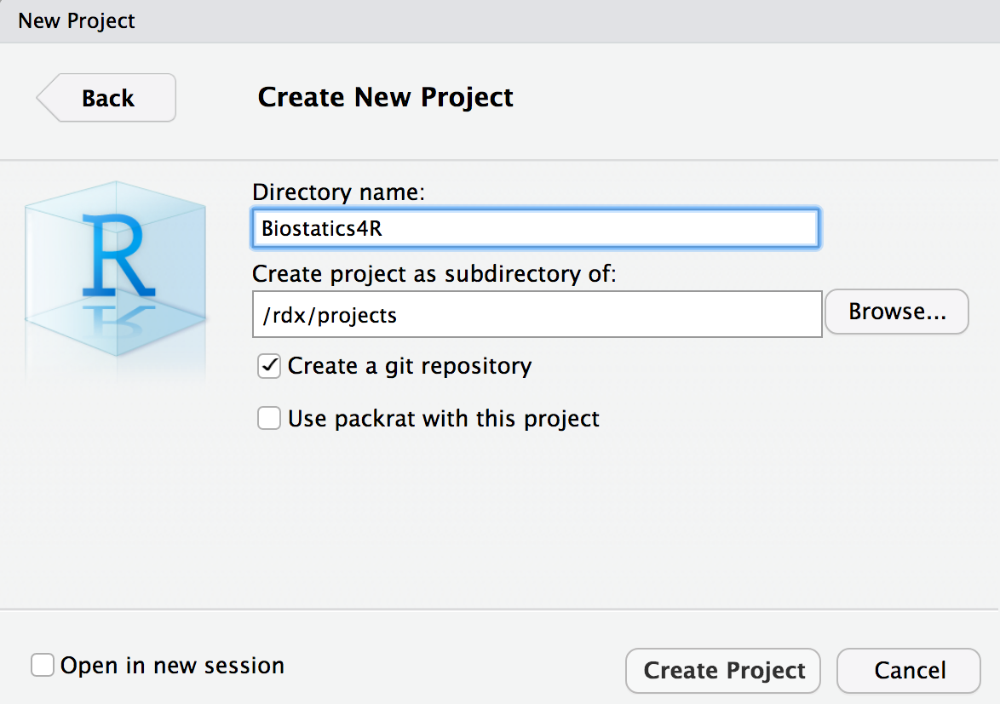

# Introduction {#intro}

Lorem ipsum dolor sit amet, consectetur adipisicing elit, sed do eiusmod tempor incididunt ut labore et dolore magna aliqua. Ut enim ad minim veniam, quis nostrud exercitation ullamco laboris nisi ut aliquip ex ea commodo consequat. Duis aute irure dolor in reprehenderit in voluptate velit esse cillum dolore eu fugiat nulla pariatur. Excepteur sint occaecat cupidatat non proident, sunt in culpa qui officia deserunt mollit anim id est laborum.

## The R Ecosystem

__Base-R__

Lorem ipsum dolor sit amet, consectetur adipisicing elit, sed do eiusmod tempor incididunt ut labore et dolore magna aliqua. Ut enim ad minim veniam, quis nostrud exercitation ullamco laboris nisi ut aliquip ex ea commodo consequat. Duis aute irure dolor in reprehenderit in voluptate velit esse cillum dolore eu fugiat nulla pariatur. Excepteur sint occaecat cupidatat non proident, sunt in culpa qui officia deserunt mollit anim id est laborum.

__The Comprehensive R Archive Network__

Lorem ipsum dolor sit amet, consectetur adipisicing elit, sed do eiusmod tempor incididunt ut labore et dolore magna aliqua. Ut enim ad minim veniam, quis nostrud exercitation ullamco laboris nisi ut aliquip ex ea commodo consequat. Duis aute irure dolor in reprehenderit in voluptate velit esse cillum dolore eu fugiat nulla pariatur. Excepteur sint occaecat cupidatat non proident, sunt in culpa qui officia deserunt mollit anim id est laborum.

__Github__

Lorem ipsum dolor sit amet, consectetur adipisicing elit, sed do eiusmod tempor incididunt ut labore et dolore magna aliqua. Ut enim ad minim veniam, quis nostrud exercitation ullamco laboris nisi ut aliquip ex ea commodo consequat. Duis aute irure dolor in reprehenderit in voluptate velit esse cillum dolore eu fugiat nulla pariatur. Excepteur sint occaecat cupidatat non proident, sunt in culpa qui officia deserunt mollit anim id est laborum.


## Getting Started

Installing the binary distribution of R should be done before installing RStudio (discussed later) although it won't hurt anything if you did that by accident.  If you installed RStudio first, you will likely see an error window after launching RStudio that will ask to take you to the CRAN website to install R. 

Follow the instructions under the heading of the operating system you are using in the next section. 

### Installing R

#### Mac

Visit the [CRAN website]https://cran.rstudio.com/bin/macosx/) and click the latest release or you can simply click the following link to [__download directly__](https://cran.rstudio.com/bin/macosx/R-3.5.1.pkg).

If your are using a legacy Mac operating system, you can install one of the Previous releases although some R packages may not be compatible. 


#### Windows

Visit the [CRAN website](https://cran.rstudio.com/bin/windows/base/) and click __Download R 3.5.1 for Windows__ or simply click the following link to [__download directly__](https://cran.rstudio.com/bin/windows/base/R-3.5.1-win.exe). 

The [installation instructions](https://cran.rstudio.com/bin/windows/base/README.R-3.5.1) from the CRAN website state:

>The distribution is distributed as an installer R-3.5.1-win.exe. Just run this for a Windows-style installer.
>
>For more details, including command-line options for the installer andhow to uninstall, see the rw-FAQ.  If you are reading this as part of an installed version of R, that is both a file rw-FAQ in this directory and a file doc\html\rw-FAQ.html.


#### Linux

To be updated later.... 


### Install RStudio

After you install R on your machine, you can immediately start using the R terminal, yet the book will focus on using the RStudio IDE. However, a special section in the Appendix will give an overview on how to use the popular multilanguage-datascience application called [Jupyter](http://jupyter.org).

Install RStudio by first visiting their [website](https://www.rstudio.com/products/rstudio/download/#download) and begin installing RStudio Desktop (Open Source License).  


## Quick Introduction to RStudio


### The Interface 

```{r, echo=FALSE, fig.cap="The main four panel window. A.) Source Panel B.) Console C.)Enviornment, History, Connections, etc D.) Files, Plots, Packages, Help, Viewer. This layout can be changed in the View menu.", out.width = '100%'}

```

## Starting a Project

```{r}

```

```{r}

```

```{r}

```

```{r}

```


## Understanding the basics

If you are familiar with excel, you probably at some point had to set the format of whatever you had placed in that cell, especially when excel prevented your calculations by treating your set of numbers as dates or even worse as text. 

In R however, cells are referred to as objects and we refer to their format as their __type__ or __mode__. 

## Reading Data Files into R {-}


The first step in every analysis requires data to be read into the environment, and learning how to do this is the first hurdle a person needs to overcome to begin learning to use R. 

Data can exist in many different formats, either as the generic universal types (e.g. csv, tsv, .json, etc) or software specific types (e.g. `.xlsx`, `` )

In this chapter, we will first discuss how to read data using functions in Base-R (when possible), and then we will discuss alternative packages, such as the multitude of packages in the [Tidyverse](https://www.tidyverse.org), and highlight their advantages over Base-R functions. 


### Generic Formats


#### CSV- Comma Separated Values
The fields are separated by a comma `,` and are typically used for loading into spreadsheets.

For example:


```{r}
csv_example_path <- "data/ASCII-comma/FEV.DAT.txt"

readLines(csv_example_path)[1:8]  # reads each line of the file

# Note: readLines(csv_example_path) is the same as
# readLines("data/ASCII-comma/FEV.DAT.txt")

```

In Base-R, CSV data can be read using the `read.csv()` function. The `read.csv2()` function is used in countries that use a comma as a decimal point and a semicolon as a field separator.  

```{r, comment=NULL}
csv_example <- read.csv(csv_example_path)

head(csv_example)
```


#### TSV- Tab Separated Values
 The fields are separated by a tabulation <TAB> or \t and are saved as `.txt` files. However, not all `.txt` files contain tab separated values.  

For example:

```{r }
tsv_example_path <- "data/ASCII-tab/FEV.DAT.txt"

readLines(tsv_example_path)[1:8]

```

```{r, comment=NULL}
tsv_example <- read.delim("data/ASCII-tab/FEV.DAT.txt")
head(tsv_example)
```

### Excel

```{r}
library(readxl)


```


### Software Specific Formats

R is increasingly recognized as the gold standard for statistical computations, yet some of your future collaborates will exclusively use Commercial Software (SAS, SPSS, Matlab, and Stata) for their statistical computations. Although these individuals are limited by the types of files they can read or write, the `haven` R-package can both read and write any of these file formats. 


```{r}
library(haven)
```


#### SAS(`.sas7bdat`), SPSS(`.sav`,`.por`, `.xpt`), Stata (`.dta`)

```{r read SAS}
sas <- read_sas("data/SAS/FEV.sas7bdat")

head(sas)
```


```{r read SPSS}

spss <- read_spss("data/SPSS/FEV.DAT.sav")
head(spss)

```


```{r read Stata}

stata <- read_stata("data/Stata/FEV.DAT.dta")
head(stata)

```

The `foreign` package included in Base-R can also be used to Reading and writing data stored by some versions of 'Epi Info', 'Minitab', 'S', 'SAS', 'SPSS', 'Stata', 'Systat', 'Weka',and for reading and writing some 'dBase' files.


###### RDS

```{r}
rds_example <- readRDS("data/RDS/BETACAR.DAT.rds")
head(rds_example)
```

###### `rdata` 
The `.rdata` format is R's specific format. Instead of using a `read.{something}` function, `.rdata` is read into the environment using `load(filename.rdata)` and retains the original name it had when it was last saved. 

```{r}
load("data/R/BETACAR.DAT.rdata")  #named betacar when it was last saved
head(betacar)
```


   